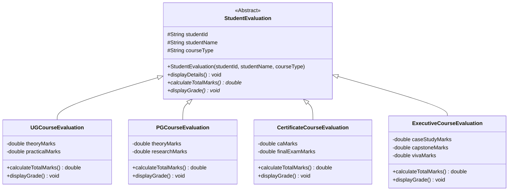
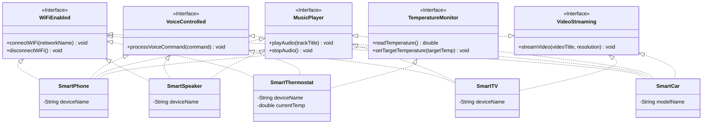
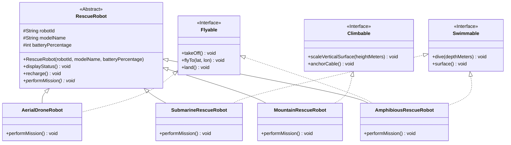

# CO2 Lab Report & OOP Architecture Design

**Topic**: Abstract Classes, Abstract Methods, Interfaces, and Multiple Inheritance in Java  
**Course**: PMC2522 Java Programming Laboratory  

---

## 1. Executive Summary & Core OOP Architectural Analysis

This laboratory exercise explores fundamental object-oriented design patterns by leveraging **Abstract Classes** and **Interfaces** to build extensible, maintainable, and type-safe software systems.

---

## 2. Theoretical Analysis & Design Decisions

### (1) Why Abstract Classes Were Used
- **Shared State and Code Reuse**: In **Task 1** (`StudentEvaluation`) and **Task 3** (`RescueRobot`), entities possess common attributes (e.g., `studentId`, `studentName`, `robotId`, `batteryPercentage`) and common behaviors (e.g., `displayDetails()`, `displayStatus()`, `recharge()`).
- **Enforcing Concrete Contracts**: An abstract class allows providing full concrete implementations of standard boilerplate methods while enforcing that domain-specific behaviors (e.g., `calculateTotalMarks()`, `displayGrade()`, `performMission()`) must be overridden by concrete derived classes.
- **Hierarchical "IS-A" Relationships**: A Postgraduate course *is a* Student Evaluation; a Mountain Robot *is a* Rescue Robot.

### (2) Why Interfaces Were Used
- **Capability Contracts ("CAN-DO" Relationship)**: In **Task 2** (`SmartDeviceControlSystem`) and **Task 3** (`EmergencyRescueRobot`), capabilities like Wi-Fi connectivity (`WiFiEnabled`), streaming (`VideoStreaming`), flying (`Flyable`), or swimming (`Swimmable`) cut across disparate object hierarchies.
- **Decoupling and Polymorphic References**: By programming to interfaces, a client can interact with an object through a specific role (e.g., controlling a device as a `MusicPlayer` or piloting a robot as a `Flyable`) regardless of its concrete underlying class.

### (3) Where Multiple Inheritance Was Required
- **Java's Single Inheritance Constraint**: In Java, a class cannot extend multiple classes (`class C extends A, B` is prohibited) to prevent the "Diamond Problem" (ambiguity in state and implementation inheritance).
- **Multiple Interface Inheritance**: 
  - In **Task 2**, a `SmartCar` must concurrently function as a `WiFiEnabled`, `VoiceControlled`, `MusicPlayer`, and `VideoStreaming` hub.
  - In **Task 3**, an `AmphibiousRescueRobot` must implement both `Flyable` and `Swimmable` while still being a `RescueRobot`.
  - Interfaces enable classes to implement multiple orthogonal capabilities safely without conflicting class state.

### (4) Feasibility of Implementing Using Only Classes
- **Limitations of a Class-Only Approach**:
  1. Without interfaces, multiple inheritance cannot be achieved in Java. If `Flyable` and `Swimmable` were classes, `AmphibiousRescueRobot` could only inherit from one of them, forcing code duplication or an awkward, brittle deeply-nested inheritance chain.
  2. Classes unrelated by inheritance (e.g., `SmartPhone` and `SmartTV`) could not share a unified `MusicPlayer` or `VideoStreaming` reference type.
  3. Design would violate the **Interface Segregation Principle (ISP)** and **Open/Closed Principle (OCP)**.

---

## 3. Class Diagrams

### Task 1: University Evaluation System

---

### Task 2: Smart Device Control System

---

### Task 3: Emergency Rescue Robot

---

## 4. Verification & Output Summary

All classes compiled cleanly with modern JDK 26, executing polymorphism across both abstract class reference arrays and specialized interface capability handlers.
